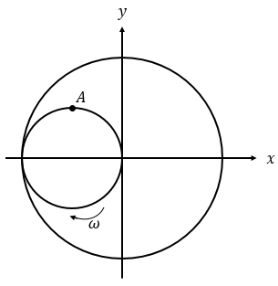

Um cilindro de raio $R$ encontra-se no interior de outro de raio $2R$ em contato no ponto $(-2R, 0)$, do sistema de eixos coordenados de origem no centro do cilindro maior. Em $t = 0$ o cilindro interno passa a girar com velocidade constante  no sentido apresentado na figura sem deslizar em relação ao externo.

Responda, para $t > 0$:

a. Qual a equação horária da posição do ponto $A$, do cilindro menor, que se encontra inicialmente na posição $(-R, R)$?
b. Determine a trajetória do ponto $A$.
c. Em uma volta completa, todos os pontos do cilindro interno percorrem a mesma distância? Apresente os cálculos para justificar.
