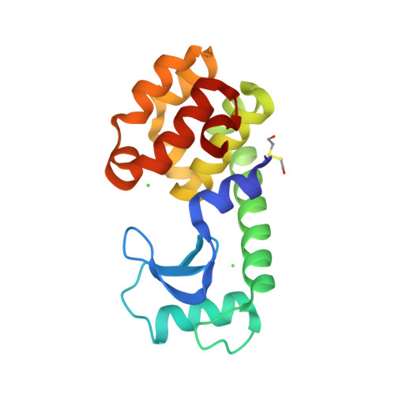

Você trabalha em um laboratório que investiga as propriedades de nanomateriais semicondutores. Uma de suas pesquisas requer que você sintetize nanocristais de $\ce{CdSe}$ ao reagir $\ce{CdO}$ com $\ce{Se}$ em solução, em temperaturas elevadas. A solução de $\ce{Se}$ é preparada dissolvendo $\pu{150 mg}$ do metal selênio em $\pu{25 mL}$ de um solvente, o 1-octadeceno. Em outro frasco, $\pu{64 mg}$ de $\ce{CdO}$ são dissolvidos em $\pu{3 mL}$ de ácido oleico e $\pu{50 mL}$ de 1-octadeceno, em $\pu{225 \degree C}$.

> Lorem Ipsum is simply dummy text of the printing and typesetting industry. Lorem Ipsum has been the industry's standard dummy text ever since the 1500s, when an unknown printer took a galley of type and scrambled it to make a type specimen book. 
> 
> It has survived not only five centuries, but also the leap into electronic typesetting, remaining essentially unchanged. It was popularised in the 1960s with the release of Letraset sheets containing Lorem Ipsum passages, and more recently with desktop publishing software like Aldus PageMaker including versions of Lorem Ipsum.

- [ ] Sim
- [ ] Não
- [ ] Talvez
- [ ] Não sei

---

#### Um teste

Gabarito
